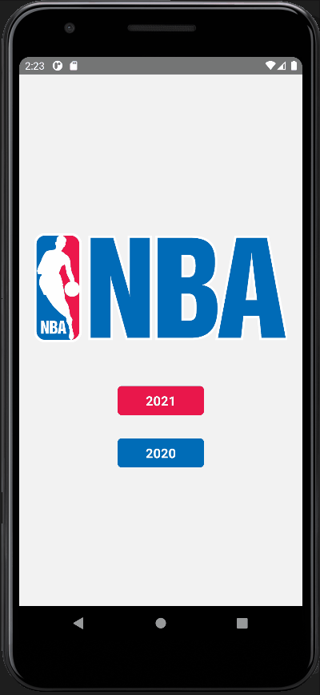

# NBA mobile app



## Install the application

### Clone the project

```
 git clone https://github.com/IsmailAISSAMI/nba-app-mobile.git
```

### Install modules

```
npm install
```

### Start Metro

First, you will need to start Metro, the JavaScript bundler that ships with React Native.

To start Metro, run npx react-native start inside your React Native project folder:

`npx react-native start`

### Start your application

Let Metro Bundler run in its own terminal. Open a new terminal inside your React Native project folder. Run the following:

`npx react-native run-android`

## Api documentation:

[Documentation link](https://github.com/kshvmdn/nba.js/blob/master/docs/api/DATA.md/)


### images 

https://ak-static.cms.nba.com/wp-content/uploads/headshots/nba/latest/260x190/1629121.png


### Others resources

https://medium.com/@avinash.sarguru/getting-nba-player-pictures-for-you-application-6106d5530943